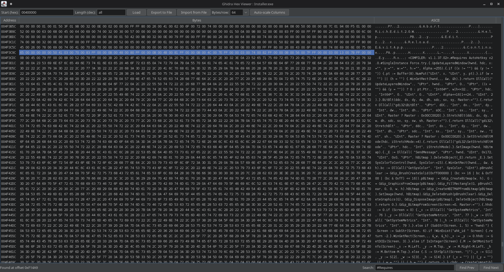

# Ghidra-Hexviewer
Simple hexadecimal viewer for Ghidra written in java

## Installation

1. Open script manager
2. Manage script directories
3. Add the hexviewer folder to the list
4. Refresh and bind a key to it

## Usage
Self explanatory, just set your byte row to your preffered size and you are done.

